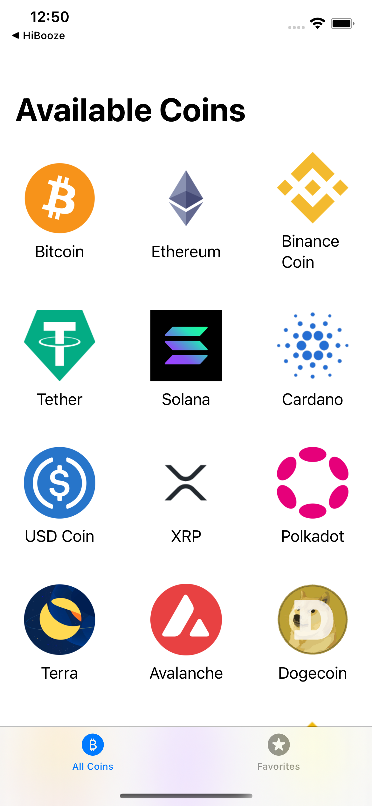
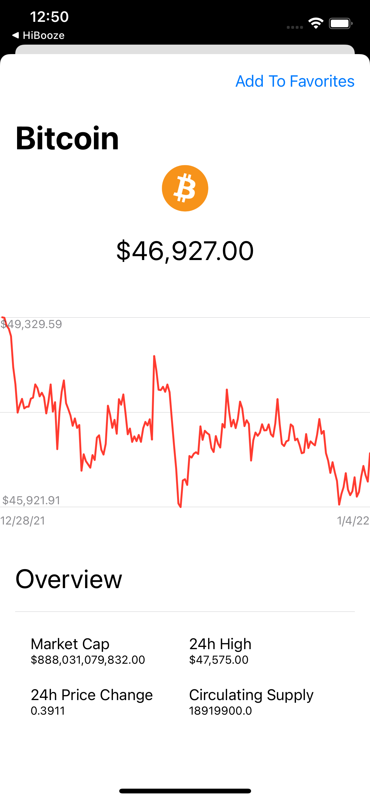

# Crypto Price Tracker
A SwiftUI cryptocurrency price tracker that showcases working with core data, networking with URLSession and async await, downloading and persisting data from the CoinGecko API, caching images, MVVM architecture, and working with line graphs.

# What I Learned
- Core Data (Entity, Attributes)
- Networking with URLSession using async await
- Fetch and cache images
- Flexible UI and grid layouts
- Download and parse JSON data from the CoinGecko API
- MVVM architecture
- Working with custom graphics and line charts

# Screen Shots

## Home Screen

## Detail View

## Adding to Favorites & Persistance

## Favorites View

